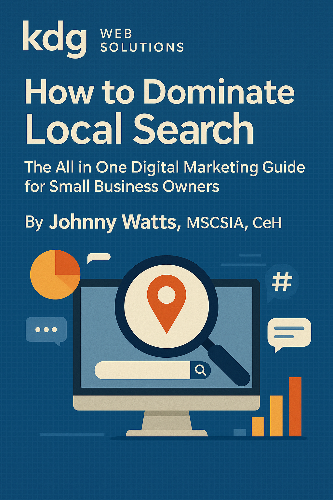

> **_How to Dominate Local Search: The All in One Digital Marketing Guide for Small Business Owners (2nd Edition)_**  
>  **By:** Johnny Watts (alias "Kaotick Jay", MSc IT, MSCSIA, CeH, LPIC-3 303  
>  **Copyright © 2025** by Johnny Watts/KDG Web Solutions. All rights under copyright reserved.  
>  **Published by:** KDG Web Solutions, Athens, Tennessee  

# How to Dominate Local Search:

**The All in One Digital Marketing Guide for Small Business Owners (2nd Edition)** 


##  Introduction

The Internet is flooded with information about Digital Marketing including helpful resources for Social Media Marketing, Reputation Management, and Business Listings Management but how do you sift through all of the information to find what you need to dominate Local Search Results and Succeed Online?

Chances are that you've typed something relevant to Digital Marketing into a search engine, expected a one stop - all inclusive solution, but were left astounded by the vast amount of resources available online - much of it nothing more than click-bait that leaves you more confused than before you started. So how do you know where to even begin?

In this book, we'll walk you through setting up an Online Presence for your business that will get you to the coveted top positions in **Local Search Results**. You'll start out by setting up or claiming business listings for your business such as **Google**, **Bing**, **Yelp**, and others. We'll cover setting up Website Search Console tools like **Google Search Console** and **Bing Webmaster Tools** that help get your pages/sites indexed quickly, and allow you to submit website URLs and sitemaps which tell search engines to crawl your site/pages for new content to index.

We'll discuss **Keyword Analytics** and **Strategy** and teach you some  web design tactics to highlight keywords for search engine crawlers. Whatever option you choose for creating/hosting/managing your website, you'll need to know how to prepare your content for **Search Engine Indexing** using my **Search Engine Optimization** **(SEO)** techniques that are proven to get results.

Once your website is set up and indexed in search engines, you'll want to generate traffic to your site, as well as build an Audience for your content. That's where **Social Media** sites like **Facebook**, **Twitter (now X)**, and **Instagram** come in. We'll cover setting up business pages on those and other **Social Media Platforms**, how to create *engaging content* relevant to your business and gain followers, and what types of content are the most effective by platform to help you grow your Social Media Following.

Finally, we’ll discuss review sites, such as Yelp and others. We’ll discuss the pros and cons of various review sites, and give advice for which platforms to use (and which to avoid if possible), how to respond to both positive and negative reviews, and how to manage those listings for best results.

We've got a lot of material to cover, so let’s jump in and get started setting up a Stellar Online Presence for your business.

## Chapter 1. "If you build it, they will come!" 
**but only if they can find it**

The people looking for your goods or services are looking for you online before they go out to shop and before they make purchasing decisions. If your business is not Online, it does not exist to the more than 90% of people who use Social Media and Search Engine queries to find businesses online. 

At a minimum, every business needs a website, Google and Bing webmaster accounts, Google and Bing Business Listings, at least two Social Media Pages, and Google Analytics. Every business needs to create or claim a variety of essential listings and pages, and to keep business information accurate across all of their different platforms.

### **Business Listings** and why they Matter.

*Business Listings* are an online collection of important information about a business. They are a freely available and essential tool to help customers find your business online and at your physical location.

#### Essential Information for Business Listings

A simple acronym, "**NAP+W**", summarizes the required information that should be included in all business listings. NAP+W stands for **Name**, **Address**, **Phone number**, + **Website**. They are essential information that potential customers will need in order to research, locate, and contact your business. Providing helpful details such as hours of operation, service areas, appointment links, and photos from your business is important to help answer common customer concerns that may be deciding factors in their buying decisions.

#### Google Business and Bing Places for Business

Google Business (https://www.google.com/business/) and Bing Places for Business (https://www.bingplaces.com/) are the most essential listings to have, as these two combined provide listings data for nearly all other listings sites. You may have heard that your business needs to be listed across hundreds of listings sites, and that you have to pay ridiculous amounts of money to services that list you on them. While the former is partly true, the latter is a deceptive ploy by unscrupulous SEO scammers. Simply creating free listings on Google Business and Bing Places for Business provides your listing data to all major listings and review sites automatically, and at no charge. Even better, once you create or claim a Google listing, you can sync the data directly to Bing.

##### Some caveats regarding Google Business Listings Scams

There are several scams associated with Google Business Listings, and it's important for business owners to be aware of these scams to protect themselves from fraud. Here are some of the most common scams and caveats associated with Google Business Listings:

1. **Fake Verification Calls**: Scammers may pose as Google representatives and call business owners to verify their business information. These calls can be convincing, as scammers often use spoofed phone numbers and official-sounding language to trick business owners into providing sensitive information. However, Google does not make unsolicited verification calls, and business owners should be cautious of any calls claiming to be from Google. If in doubt, business owners should hang up and verify their listing information directly on the Google My Business website.

2. **Paid Verification Scams**: Scammers may also offer to verify a business's Google listing for a fee. However, Google My Business verification is a free process and business owners should never pay for this service.

3. **Impersonation Scams**: Scammers may create fake Google Business Listings for businesses that don't exist or for businesses that have closed or moved. They may also claim to be an authorized representative of a legitimate business and update the listing with fraudulent information, such as a fake phone number or website. Business owners should regularly monitor their listings to ensure that all information is accurate and up-to-date.

4. **Phishing Scams**: Scammers may send phishing emails that appear to be from Google, asking business owners to verify their account information. These emails often contain links to fake Google login pages where scammers can steal login credentials. Business owners should be cautious of any emails claiming to be from Google and should always verify the authenticity of the email sender and link before entering any login information.

Once you create or  claim your listing, don't be surprised if you start receiving calls purporting to be from Google, or to be about your Google listing. These callers generally say something like "Your listing is inactive" or that it is "unverified". Google does not directly contact business owners via phone calls or texts, so if you get these calls, ignore them, and consider marking them as spam to help combat these types of scams. If Google needs to contact you, they will reach out via email. The only exception to this is a single automated call or text from Google with your verification code when initially verifying your ownership of the business and only *if you choose that method of verification*. 

By the end of this guide, your Google and Bing Business Listings **will be verified**, so you can safely filter these deceptive callers. Legitimate SEO and Web Design experts will not use this type of *ambulance chasing* tactics. It is not only unethical, its probably  [criminal](https://businesslaw.uslegal.com/deceptive-trade-practices-laws/).

##### Consider the following tips to recognize and avoid Google Business Listings scams:

- **Unsolicited calls or emails**: Be wary of unsolicited calls or emails from people claiming to be from Google. Google does not make unsolicited calls, and they will never ask for payment to verify your business listing. If you receive a call or email that seems suspicious, hang up or delete the email and go directly to the Google My Business website to verify your listing.
- **Poor grammar or spelling**: Poor grammar or spelling: Scammers may use poor grammar or spelling in their communications, which can be a red flag that something is not legitimate. Legitimate communication from Google will generally be well-written and free of errors.
- **Suspicious links or attachments**: Be careful of clicking on links or downloading attachments in emails from unknown senders. Scammers may use these links or attachments to install malware on your computer or steal your personal information.
- **Unusual payment requests**: Google does not charge for business listing verification or optimization. If someone asks you to pay for these services, it is likely a scam. Be cautious of any payment requests that seem unusual or suspicious.
- **Verify information independently**: If someone asks you to verify your Google Business Listing information, do not provide sensitive information like your credit card or social security number. Instead, verify your information independently by going to the Google My Business website and logging into your account.

Google also provides additional tips for avoiding scams on their support page.

You should report any Google Business Listings scams to protect yourself and other business owners from fraud. Here's how:

1. **Report the scam to Google** If you receive a suspicious phone call, email, or message related to your Google Business Listing, report it to Google by visiting the Google My Business Help Center and clicking on the "Contact Us" button. You can also report a scam directly from your Google My Business account by clicking on the "Support" button in the top right corner of the page and selecting "Need More Help?"
2. **File a complaint with the Federal Trade Commission (FTC)**: The FTC is responsible for investigating and prosecuting fraudulent business practices. You can file a complaint with the FTC online at ftc.gov/complaint or by calling 1-877-FTC-HELP (1-877-382-4357).
3. **Contact your local law enforcement**: If you have been a victim of a scam, you should contact your local law enforcement agency to report the incident. Provide as much information as possible, including any phone numbers or email addresses used by the scammer.

By reporting a Google Business Listing scam, you can help prevent other business owners from falling victim to the same fraud. Remember to stay vigilant and protect your personal information by verifying any requests for sensitive information before providing it.

##### Further Information

- [Google My Business Help: Avoid Scams and Fraudulent Calls](https://support.google.com/business/answer/6212928?hl=en)
- [FTC: Scams Targeting Small Businesses (PDF)](https://www.ftc.gov/system/files/documents/plain-language/bus69-scams-targeting-small-businesses.pdf)
- [BBB: Scammers Impersonating Google My Business](https://www.bbb.org/article/news-releases/21906-beware-of-scammers-impersonating-google-my-business)

---

### Make your Listings Work for You

Your Business Listings' effectiveness depends on the availability and accuracy of listings. What I mean by this is that there are a variety of sources for business listings including search engines, directories, maps, and social media sites. When it comes to business listings, more is better. Your presence on as many sources as possible will cover the most common avenues for customers to find you, but remember that your information should be uniform across all sources. Be sure that you provide the same accurate information across all listings including using the same formatting (i.e., your website should not be "somesite.com" on some listings, but "www.somesite.com" or "somesite.org" on others - even if all of those point to your website).

### Accuracy in Business Listings is Critical

Listings are free advertising with unlimited potential reach for your business. Accurate and readily available listings assure that customers are able to find your locations while you're open for business. However, missing or incorrect information can lead to [loss of customer trust](http://searchengineland.com/survey-consumers-blame-brands-bad-local-data-186224) and lost revenue.

### Claiming What's Already Yours

Unless you are starting a brand new business, chances are that some listings for your business already exist, and this is especially true if you have created social media pages or websites. As you have already learned, Google and Bing Listings provide the data for nearly all other business listing and review sites, with Bing now gathering much of its own data from Google.

#### Add/Claim your Business on Google Business and Bing Places for Business

##### Google Business Page

Head on over to [https://www.google.com/business/](https://www.google.com/business/) to setup your free listing. To use an existing Google Account, choose to "Sign In".  Otherwise "Manage Now". Follow the prompts.

Now that you are signed in/up, click on the "Add Business" item at [https://business.google.com/locations/](https://business.google.com/locations/) and choose to "Add single business". Enter your Legal Business Name.  If there is an existing listing for your business, Google will display it, and you will choose it. If not, create a new listing by following the prompts. You will be required to verify your ownership of the business using your choice of a variety of options.  By far, the simplest method is to use the phone number already listed for your business to receive a call with your verification code. In the rare case that you do not have access to the listed phone,(i.e., your phone number has changed) you will have to use the address verification method which simply means you have to wait for a code to be sent to you via USPS.

##### Bing Places

Once you have verified your ownership, Google will create and publish your listing. At this point head over to [https://www.bingplaces.com/](https://www.bingplaces.com/) where you will follow very similar steps to create or sign in to an existing account.  Once signed in/up, you will simply choose to import the data from Google My Business and sign in to the relevant account to start syncing.

#### Search for and Claim Other Listings

If your business already had a Google listing, there most likely are other listings for you, which you should claim where possible. Even if you have just created a new Google Listing using this guide, you should simply search your favorite search engine for your legal business name, and follow any listings links where you will look for an option to "claim this business".   Some important listings to specifically search for are, Yelp [https://yelp.com](https://yelp.com), CitySearch [https://citysearch.com](https://citysearch.com), Yellow Pages [yp.com](yp.com), and Facebook [https://facebook.com](https://facebook.com), as these popular platforms are very likely to already have your listings submitted via their users. Once you have created or claimed as many of these listings as you can you simply need to wait for your listings to appear automagically all across the web from your new/claimed Listings.

By following these tips, you can make your online business listings work for you and attract more customers. Keep your listings up-to-date and engaging to maintain a strong online presence.

---

## Chapter 2. SEO Demystified – HTML Semantics
**"It's not just code... it's a signal to the machines."**

*Search Engine Optimization (SEO)* is a process that involves using tactics both within and outside of a website to ensure that the website is indexed in search engines, like Google and Bing, and that both the brand and the website are highly ranked in searches for relevant keywords and phrases.

#### SEO is not as hard as the SEO guys make it seem
Search Engine Optimization does not require any addons, subscriptions, or extensions to be added to your website, does not require you to purchase advertising, and does not require an SEO expert or specialist. In fact, most SEO occurs within the design of a website by understanding basic html and tag semantics and using markup to highlight keywords and phrases. This sounds more complicated than it actually is. This guide will walk you through the steps needed to Optimize a Website for Search Engine Indexing and Submit a Website to Google and Bing.

### Step 1: HTML SEO Basics

#### HTML Validation
Proper HTML markup is essential to ensuring that your website is both accessible and indexable by search engines. While search engines like **Google** are tolerant of some minor markup issues, invalid or poorly structured HTML can interfere with proper page rendering, indexing, and usability - especially across different devices and browsers.

In this section, we'll highlight some of the most commonly overlooked HTML validation issues that can negatively impact your site's visibility in search results. Fixing these issues not only improves compliance with web standards but can also contribute to better SEO performance and user experience. Let's dive in:

A *website* is a collection of one or more *web pages*. These pages are written in <details><summary>**Hypertext Markup Language (HTML)**</summary>Although websites may be powered by a wide variety of technologies - such as scripting languages, databases, and frameworks - the final output delivered to the user's browser is HTML. This standardized markup language is what browsers interpret to render the visual representation of a web page.</details> - a web development language that uses *elements*, denoted by *tags* such as `<h1>` (a level 1 heading) or `<p>` (a paragraph), to *mark up* content for display in a *web browser*.

*Web browsers* interpret the HTML markup and render it into the visual layout and text that users see when visiting a website. Tags are enclosed within the *less-than* (`<`) and *greater-than* (`>`) symbols. Most tags consist of both an opening and a corresponding closing tag (with some exceptions for self-closing elements like `` or `<br>`).

Example:

* Opening tag: `<h1>`
* Closing tag: `</h1>`

Together, these tags define the beginning and end of an HTML element, allowing browsers to understand the structure and meaning of the content.

A web page **must** start with the *document type declaration*, `<!doctype html>` indicating that the document type is *html markup*. The doctype tag is one of the few that does not need a closing tag. This is followed by the opening *html* tag `<html lang="en-US">`.  The *html* tag is the root element of any HTML document. It encapsulates all other HTML elements (excluding the <!DOCTYPE> declaration) and indicates to the browser that the enclosed content follows the HTML markup language structure. In the example above, the *lang* attribute indicates that the content will be in US English. The opening html tag shoul be followed by the head tag, and then the body tag. Tags are closed in the order they are opened for proper nesting. For example, to complete our skeletal HTML page framework for the fictitious pizza restaurant we'll be using throughout this guide, here is how a basic structure might look:
```html
<!doctype html>
<html lang="en-US">
    <head>
        <title>Pappa Greene's Pizza - Chattanooga, TN | Hand-Tossed Crust & Homemade Sauce!</title>
    </head>
    <body>
        <p><strong>Pappa Greene's</strong> <b>Hand-tossed Pizza</b> Features our Signature <b>Homemade Sauce</b>. Located in <strong>Downtown Chattanooga</strong>, our cozy, <b>family atmosphere</b> is the perfect place for Lunch or Dinner.</p>
    </body>
</html>
```

#### Required Tags for SEO

There are some HTML tags that are required in order to be indexed by search engines. Without these tags, search engines cannot determine the subject or content of a web page with enough accuracy to properly index it. Let's discuss these tags and how to implement them.  

##### The `<title>` tag
This is your first and most important opportunity to highlight keywords specific to your site. A website title should convey the name and location of your company, an indication of your category of business, and a brief tagline which incorporates some keywords. Titles should be fairly short, no more than 60 or so characters (not including the element's tag or attributes). There should be only one `tile` element on any given webpage.
**Example:**

```html
<title>Pappa Greene's Pizza - Chattanooga, TN | Hand-Tossed Crust & Homemade Sauce!</title>
````

The semantic meaning of `<title>` is simple: a title. This text appears:
- As the clickable headline in Search Engine Results Pages (SERPs)
- In the browser tab or window title bar
- As the label when bookmarking a page

Because of its role in search indexing and user experience, the `<title>` tag carries high SEO weight. Therefore, it should contain *targeted keywords* that your audience would likely use when searching for your product or service.

For example, if someone is craving pizza, they might search for `pizza near me`. If your page title includes relevant keywords like `"Pappa Greene’s Pizza - Chattanooga, TN | Hand-Tossed Crust & Homemade Sauce"`, it's more likely to be included in the top results for that query - especially when paired with strong local SEO practices.

---

##### The `<meta description>` Tag

The next required tag is the *meta description*. Unlike many HTML tags, this one is a **self-closing tag** and includes both a `name` and a `content` attribute:

```html
<meta name="description" content="50 to 80 words describing the business, the website, services, or products." />
```

This tag allows you to tell search engines what your page is about. When crafted well, the description will:

* Speak directly to potential customers in **natural language**
* Include relevant **keywords and phrases**
* Avoid **keyword stuffing**
* Encourage **click-throughs** by being compelling and clear

This content is also displayed in the **Search Engine Results Pages (SERPs)** as the summary below the page title - making it the first thing most users will read. The content you use here shapes a potential customer's *First Impression* of your business.

##### Placement Matters

Both the `<title>` and `<meta description>` tags must appear **within the `<head>` section** of your HTML document. These two elements are **critical** for SEO and are **required** for your pages to be properly indexed by major search engines like Google and Bing.

> **Remember:** First impressions last. Well crafted `title` and `meta description` content are your best opportunity to win over a customer *before* they even visit your website or business location.

---

#### Robots Meta Tag

The main purposes of the *Robots Meta Tag* are to instruct search engine crawlers (also called bots or spiders) **whether to index a page** and **whether to follow links** from that page.

You’ll need to provide clear instructions for bots to index your main page and follow internal links. When configured properly, this results in the search engine automatically crawling and indexing all linked pages, **unless those pages are explicitly excluded** (e.g., with a `noindex` tag or a `robots.txt` directive).

To allow indexing and full link traversal, use:

```html
<meta name="robots" content="index, follow" />
```

This tells bots:

* `index`: Include this page in search engine results.
* `follow`: Follow all links on this page and index those pages as well (unless overridden).

To instruct bots to ignore a page completely—i.e., do not index it or follow its links—use:

```html
<meta name="robots" content="noindex, nofollow" />
```

This tells crawlers to:

* `noindex`: Not include the page in search engine results
* `nofollow`: Not crawl or index any links found on that page

---

### HTML Semantics

Each predefined HTML tag has **semantic meaning** that should be considered when designing a webpage. Many designers use tags purely for styling, without considering their semantic purpose — which can negatively affect accessibility, SEO, and document structure.

For example, HTML defines **six levels of heading tags**: `<h1>` through `<h6>`. These tags represent **structural hierarchy**, not just formatting. They have both **semantic value** and **SEO weight**.

* `<h1>` is the **primary headline** of the page.

  * It should be used **only once per page**.
  * It should contain **important keywords** or **phrases** that summarize the page content.
* `<h2>` through `<h6>` are used for **subheadings**, each with progressively less weight in both semantics and SEO.

  * These can be used **multiple times** as needed.

> Think of heading tags like a table of contents:
>
> * `<h1>` is the book title.
> * `<h2>` is a chapter heading.
> * `<h3>` is a section heading within that chapter, and so on.

Search engines give more weight to content within higher-level heading tags. This makes **proper heading structure** essential to keyword targeting and on-page SEO.

> ⚠️ Do not use headings simply to change font size or color. Use them **according to their meaning** and style them with CSS.

---

#### Paragraphs and Emphasis Tags

The `<p>` tag denotes **paragraph content**. On its own, it doesn't provide SEO value - but the inline tags *within* a paragraph can.

##### Semantic Emphasis:

* `<strong>`: Used to indicate **strong importance** or emphasis.

  * Content inside this tag gets **significant SEO weight**.
  * Best used for **products**, **brands**, **services**, or other business-critical keywords.
* `<b>`: Also bolds text, but conveys **stylistic emphasis** rather than semantic importance.

  * Carries **moderate SEO weight**.
  * Appropriate for descriptive words like "hand-crafted" or "award-winning."

---

##### Correct Usage Examples:

```html
<p><strong>Pappa Greene's Pizza, Chattanooga, TN</strong></p>
<p><b>Home of Pappa Greene's Signature Sauce</b></p>
<p><strong>Pappa Greene's Pizza, Chattanooga, TN</strong><b>Home of Pappa Greene's Signature Sauce</b></p>
```

> ⚠️ `<strong>` and `<b>` should **not be nested inside each other**, nor misused for purely visual effect.

---

### SEO for Website Images

Images offer **multiple opportunities** to improve a website’s search engine visibility and accessibility. Each image should be considered an SEO asset, not just a design element.

#### 1. **Filename**

The **image filename** plays a critical role in search engine optimization. Search engines crawl and index filenames to help determine the relevance of an image to a search query. Therefore:

* Use **lowercase letters** only.
* Use **keywords** that accurately describe the image content.
* Separate words using **hyphens** (`-`) rather than underscores or spaces.
* **Avoid all punctuation**, including:

  * Commas `,`
  * Periods `.` (except the one before the file extension)
  * Quotation marks `"` `'`
  * Parentheses `()` and brackets `[]`

> ❌ Bad: `Pizza_Greene_(Special).jpg`
> ✅ Good: `pappa-greenes-specialty-pizza.jpg`

**Best Practice Example:**

```text
pappa-greenes-large-deluxe-pizza.jpg
```

> 🔍 *This filename is keyword-rich, properly formatted, and machine-readable—optimized for both indexing and clarity. This helps search engines associate the image with relevant keyword phrases.*


#### 2. **img ALT Attribute**

The `alt` (alternative text) attribute serves two main purposes:

* Provides a **textual description of the image** for screen readers (accessibility)
* Helps **search engines understand** the image content for indexing

Guidelines:

* Use **natural, descriptive phrases** that explain what the image shows
* Include **1–2 relevant keywords** when appropriate, but avoid stuffing
* Keep it **under 125 characters**
* Do **not** repeat the filename or use image-related filler like "image of..."

> ✅ Good:
> `"Pappa Greene's Deluxe Pizza with sausage, pepperoni, onions, and homemade sauce"`

> ❌ Bad:
> `"image of pizza"` or `"pizza image pappa greenes pizza pizza toppings best pizza"`

**Example:**

```html

```

#### 3. **img TITLE Attribute**

The `title` attribute provides a **tooltip** when a user hovers over the image. It offers **minor SEO benefit** but contributes to **user experience** and **contextual reinforcement**.

Guidelines:

* Make it short and natural
* Optionally reinforce branding or a call-to-action
* Avoid duplicating the `alt` attribute exactly

> ✅ Example:
> `"Try our Chattanooga-famous Deluxe Pizza!"`

**Example:**

```html

```


#### 4. **Lazy Loading**

Lazy loading improves **page load time and performance** by deferring the loading of images until they are in (or near) the viewport.

Use the native `loading="lazy"` attribute:

```html

```

> 🧠 *Lazy loading is especially useful for content-heavy pages or mobile-first design strategies.*

---

#### 5. **File Format & Compression**

Choosing the right format and optimizing the file size balances **image quality** with **page speed**, both of which affect SEO.

**Recommended formats:**

| Format  | Best For                      | Notes                            |
| ------- | ----------------------------- | -------------------------------- |
| `.jpg`  | Photographs & food images     | Use 70–85% quality for web       |
| `.png`  | Logos, icons, or transparency | Larger file size, supports alpha |
| `.webp` | All-purpose, next-gen format  | Best balance of size and quality |

**Tips for Optimization:**

* Compress images using tools like:

  * [TinyPNG](https://tinypng.com)
  * [Squoosh](https://squoosh.app)
  * `imagemagick` or `mozjpeg` (for CLI use)
* Keep image file sizes **under 100KB** where possible (unless full-res is required)
* Use **responsive sizes** via CSS or the `srcset` attribute when needed

---

### Step 2: Google and Bing Search Consoles

Now that you have marked up your website's keywords, you will need a *Google Search Console* (aka *Google Webmaster Tools*) account. This account will serve as your dashboard for initially submitting your site for indexing, and for uploading/maintaining sitemaps.  Sitemaps are not required for this approach, and are beyond the scope of this guide. We will be using manual url submission. 

To signup, visit https://search.google.com/search-console and follow the prompts to "Get Started". If you already have a gmail account, you can use it here. Once signed up, you need to create a *property* which is Google Speak for adding your website. You will click the top-left dropdown and choose "Add Property". Because of varying methods for adding DNS records, I will not cover DNS Properties here. 

After adding a property, you will use the "URL Prefix" Option to verify your site ownership for Google. Enter your site url and tap "Continue". First, Google will try to automatically verify the domain. If automatic verification fails, Google will generate a simple html file which you will download from Google, and then place in the root of your website. This simply means uploading the file to your server or host. Leave the filename and content unchanged, upload it, then head back to the Google Search Console. Click the "Verify" Button, and Google will check the file that you uploaded to your site to simply verify its existence and content.  

After verification, leave the file on your site so that you won't have to verify again later. Note that if you have both http and https versions, you will need to create a separate property for each. The hard stuff is done for Google.  All that's left is to point Google Searchbots to your index or main page by typing your full url, for example `https://pappagreenespizza.com` into the url inspection tool at the top center of your console and submitting. 

That's it, you're indexed on Google (*unless you got warnings or errors that will need to be fixed and rechecked before they can be indexed*). Waiting time for indexing to propagate can vary from nearly instant to 48 hours or more. Generally, new websites that are not already indexed get priority, so it's best to request indexing for a specific url only after its final publication because subsequent crawls of indexed urls are not prioritized. Most of the time, newly submitted urls will be indexed within minutes. In most cases where indexing is delayed, you will find that Google has sent you a message regarding errors that prevented indexing with links to help for fixing the issues.

Now, head over to [https://www.bing.com/webmasters/](https://www.bing.com/webmasters/) and you will repeat a nearly identical process to the *Google Search Console* setup to complete your *Bing Webmaster Tools* setup. Follow the prompts to add your website, to verify ownership, and then to submit your index page URL. Your website is now indexed and will shortly have all of its pages included in both Google and Bing searches.  

Chances are, if you are performing these steps for the first time, you will see a huge jump in your site search result ranking within a few days. By choosing good, relevant keywords and phrases, this strategy **will** get you to the *coveted top positions of search results* for those keywords very rapidly.

## Chapter 3. Keyword Analysis Simplified: 
**These are not the Keywords you're Looking For**

Though the "SEO industry" would paint it otherwise, **Search Engine Optimization** is not a closely held secret that requires membership in a secret society of psychic warriors to learn. Terms like **Keyword Analytics** were created for no other reason than to make “what would people type in the search engine to find me?” seem like an obscure science.

**Keyword Analysis** is that simple: **"what would people type to find my business?"**

For our fictitious "Pappa Greene’s Pizza" in Chattanooga, Tennessee, our keyword analysis simplifies to:

> **pizza near me**

The problem is that big franchises dominate those results. Pappa Greene’s needs to stand out in the crowd of big household names.

### Long vs. Short Tail Keywords

Common search terms relevant to **Pappa Greene’s Pizza**—such as *“restaurant,” “pizza,” “delivery,”* and general geographic terms like the searcher’s city or state—are called **Short Tail Keywords**.

> Unless Pappa Greene is prepared to spend millions on advertising, these terms alone won’t get top rankings.

Let's assume that **Pappa Greene’s Pizza** is known for:

* Their **signature homemade sauce**
* Their **hand-tossed crust**
* Their **cozy, family atmosphere**

Very specific terms -such as brand names, unique descriptors like *homemade*, and trademarked phrases- are called **Long Tail Keywords**. Even specific location terms like *“south side”* or *“downtown”* fall into this category.

Your section is well-structured and accurate. Below is the **Markdown-preserved version** of your content, formatted cleanly without altering any phrasing or tone—strictly respecting your writing style and intent.

---

### Keyword Strategy: Stand Out in the Crowd

To climb to the top of search results, **Pappa Greene’s Pizza** must use a variety of both **Long Tail** and **Short Tail** keywords.

A **Keyword Strategy** is simply the process of **implementing** your keyword research into content.

From our keyword analysis, here are some phrases to optimize for:

* `hand tossed crust`
* `pizza`
* `downtown Chattanooga`
* `family owned`
* `homemade sauce`
* `family atmosphere`
* `pappa greene’s pizza`

#### Implementation

Start with the **domain name**:

* `pappagreenespizza.com`
* `downtownpizza.com`

Then, implement your keywords into:

* Titles and headings
* Meta descriptions
* Image filenames
* ALT attributes
* URLs
* The first 100 words of your content

Once we have written our SEO optimized content, we can use semantic HTML markup to further emphasize our keywords.

#### Example SEO-Optimized Block:

> **Pappa Greene’s** **Hand-tossed Pizza** features our Signature **Homemade Sauce**. Located in **Downtown Chattanooga**, our cozy, **family atmosphere** is the perfect place for lunch or dinner.

---

#### HTML Version of the Example Above:

```html
<strong>Pappa Greene's</strong> <b>Hand-tossed Pizza</b> Features our Signature <b>Homemade Sauce</b>. Located in <strong>Downtown Chattanooga</strong>, our cozy, <b>family atmosphere</b> is the perfect place for Lunch or Dinner.
````

---

SEO doesn't stop at the website.

The same content strategies for websites apply to all Internet content: 
- Social Media posts
- email marketing content (if you must) 
- printed material 

All of these and more can and should be **branded**

> **Keyword Stuffing: Don’t Overdo It**
> It may seem tempting to markup every imaginable keyword that you can think of, but this is known as "*Keyword Stuffing*" and should be avoided. Search Engines such as Google look for relevant, high quality content over quantity and will penalize any such strategies by removing the content from indexing. Using keywords over and over or Marking up every occurrence of a keyword are other examples of *Keyword Stuffing*. Content should not seem as though it is targeted toward search engines. It should be written as though speaking directly to a person.

## Chapter 4. Reputation Management: 
**What's in a Name?**

*Reputation Management* involves finding, claiming, or creating listings, monitoring reviews on review sites, cultivating reviews, responding to both positive and negative reviews, and preventing or removing fraudulent or deceptive reviews (such as false reviews from malicious competitors).

Your business reputation can be the difference between success and failure. In today's digital age, your business's reputation is determined by consumer reviews on review platforms like Google, Facebook, and Yelp. Review platforms provide an invaluable tool to business owners who write timely and effective responses to reviews. Though it is important to respond to negative reviews and resolve complaints or concerns, its just as important to respond to positive reviews to show that you appreciate customers taking the time to review your business while also encouraging other customers to do the same. Since **[92% of consumers read reviews online](href="https://www.brightlocal.com/learn/local-consumer-review-survey/)**, review responses are a free and powerful tool for businesses to reach new customers. An effective response will assure that a happy customer becomes a regular, but even better - **70% of complaining customers will return if you resolve the complaint**. The review response process allows the opportunity to engage with the reviewer to publicly show that you genuinely care about your customers and addressing their concerns.

### How to Respond to Positive Reviews

Responding to positive reviews is very simple, and a powerful opportunity to promote customer loyalty and attract new customers. Thank the customer - by name - for their review, brand it, promote it and invite the customer to come back (and bring their friends)!

- Thank the customer
- Brand your business
- Promote your services
- Invite them back

#### 1. Thank the Customer and Make it Personal

You wouldn't ignore a compliment in real life—likewise, never ignore a positive review. Always thank the reviewer **by name** and respond specifically to what they said.

Taking the time to write a personalized response shows the customer that their feedback mattered enough for you to address it directly. That kind of personal attention makes people feel valued—and that’s memorable.

Avoid the temptation to rely on **canned responses** or **automated replies**. Customers are savvy. They can spot generic replies, and using them sends the wrong message: that you don’t care enough to respond personally. A thoughtful, tailored reply goes a long way in reinforcing loyalty and building goodwill.

#### 2. Brand It

*Positive Review Responses* are a great opportunity to improve the chances of those reviews appearing in search results. Using your **business name** and **location** in your response will greatly improve visibility of those reviews. Likewise for using your **business category** (i.e., *restaurant*, *hotel*, *nightclub*, *law office*, etc.)

#### 3. Extend an Open Invitation

Invite the customer to return, and maybe to try your **signature homemade sauce** or to come in for your **promotional event next month**. Positive review responses are a great place to spread the word. Invite them to **try something different** on their next visit or to **bring their friends**!


##### Sample Positive Review from a Customer:

> ⭐ ⭐ ⭐ ⭐ ⭐ 
> "Absolutely love this place! The hand-tossed crust is perfection and the homemade sauce is out of this world. You can really taste the difference. The staff was super friendly and the whole vibe felt like a family dinner. Pappa Greene'’'s has definitely become our new Friday night tradition!" 
>
> — *Jessica M.*

---

##### Sample Response from Pappa Greene’s Pizza:

> Hi Jessica,
>
> Thank you so much for the kind words and for taking the time to leave such a thoughtful review! We’re thrilled to hear that you enjoyed our **hand-tossed crust** and **signature homemade sauce** -we take a lot of pride in making everything from scratch here at **Pappa Greene’s Pizza in Downtown Chattanooga**. 
>
> We're especially glad you felt that welcoming, family atmosphere we work hard to create - it’s what sets our little **family-owned pizza restaurant** apart. 
>
> Next time you stop by, be sure to try our new *Stuffed Crust Deluxe* - it's quickly becoming a fan favorite! And don't forget to bring your crew - Fridays at Pappa Greene’s are better with friends! 
>
> Looking forward to seeing you again soon, 
>
> -The Team at Pappa Greene’s Pizza

 **Remember: Each positive review is a chance to promote your business and foster customer loyalty - and potential customers reading your responses will notice.**

### How to Respond to Negative Reviews
Believe it or not, most of the same rules that apply to positive review responses also apply to negative review responses. However, your response to a negative review should be handled delicately. The first thing to do is to apologize for the problem. Acknowledge the complaint, and sympathize. You have this one opportunity to turn a bad experience around. Tactfully resolving challenging complaints shows that you value your business, and your customer's experience. Follow these simple steps to make your response to a negative review count:

How to respond to negative reviews:  

1.  Apologize and Empathize  
    No matter what happened, you should simply apologize and express your regret that your customer's experience didn't meet their expectations.
2.  Make the conversation private  
    Invite the reviewer to reach out via phone, email, or both. Don't discuss or disclose details, and don't ask questions in the review response. Just as you would delicately manage an unhappy customer at your physical location to avoid making a scene, these discussions should be steered toward a private arena.
3.  Promote  
    Pappa Greene's Signature Sauce may not be everyone's cup of tea, but its what they're known for. Everyone has different likes and dislikes, so when a customer leaves a negative review about the horrible special sauce, feel free to suggest alternatives. However, leave your business name, location and category out of your response to a negative review to help assure that this one negative review isn't the first thing that searchers see. Putting it all together, an effective response could look like:
    
    > "Thank you for taking the time to share your experience. I am so sorry to hear that our signature sauce didn't meet your expectations. Our Signature sauce is a customer favorite, but I understand that tastes vary. I invite you to try one of our other sauces or a wide variety of other menu items. Please reach out to us via email at customer-care@pappagreenespizza.com or by phone at 555-1212 so that we can personally discuss your experience."

### How to Respond to Fake or Malicious Reviews

Dealing with fake or malicious reviews is a challenge for businesses because they can harm the company's reputation and impact its bottom line. Yes, it really does happen. An unscrupulous competitor, a disgruntled employee, a random malicious actor - whatever the reason, not all reviews are honest accounts of genuine experiences. 

When it happens, let's face it, you are going to be angry. Its unfair, unethical, and probably illegal and how dare they smear your good name! You should be angry - I certainly would be! But, you should still treat these reviews just like any other negative review, even if it seems unfair or even counter-intuitive to not call them out for their dishonesty. Consumers aren’t fools. They can spot a fake review - positive or negative. If it reads like an ad for your competition, there’s a good chance that’s exactly what it is.

But you don't just take it lying down. Fake reviews violate the terms of every legitimate review platform. Reviews written by - or on behalf of - competitors are not only unethical, but may also violate deceptive business practice laws depending on jurisdiction.

Every review platform has a method for business owners to dispute or flag reviews, and their policies are easily accessible and freely available. You should first closely examine these policies for terms prohibiting the deceptive content, and point to those terms in your dispute. Some common terms of use that can be helpful in your dispute are:

*   provisions that the review "must" reference an actual visit or interaction with the business
*   prohibitions against false claims or misrepresentation of facts
*   prohibitions against fake or duplicate accounts
*   rules against reviews from competitors or their employees
*   rules preventing vindictive or retaliatory content
*   rules against posting anything that violates applicable laws
*   provisions against reviews that contain hate speech or personal attacks

While awaiting a review platform's decision on your dispute, your next step is to respond to the review. A professional and courteous response can demonstrate to other potential customers that you take customer feedback seriously and are committed to providing excellent service.

You can help mitigate the impact of malicious reviews by frequently engaging with satisfied customers, encouraging them to leave positive reviews on multiple platforms. This can help counterbalance any negative reviews and improve your business's overall reputation. Actively monitoring reviews lets you respond quickly to any fake or malicious activity. You can set up alerts for new reviews or hire a reputation management service to help you stay on top of your online presence.

If a dispute fails to get a fake review removed, consult an attorney to determine if there are legal measures that you can take to force the removal: such as if it contains *defamatory* or *libelous* content. **Avoid the urge** to publicly discredit the reviewer - even if you know the review is false. This can lead to public disputes which often spiral and can damage your brand more than the original review.

>Overall, dealing with fake or malicious reviews requires a proactive approach to reputation management. By responding to reviews, engaging with satisfied customers, and monitoring your online presence, you can help minimize the impact of negative reviews on your business's reputation.

---

### Final Thoughts on Reputation Management

Managing your online reputation requires diligence and a proactive strategy. Whether reviews are glowing, critical, or fraudulent:

- Respond with professionalism
- Encourage positive engagement
- Monitor and manage your presence consistently

Done right, reputation management turns even the worst reviews into branding opportunities — and the best ones into magnets for new customers.

## Chapter 5. Social Media Marketing

**"I’m kind of a big deal… people know me."**

That’s the energy your business should bring to social media. Not arrogance—but **awareness**. When done right, your business becomes a recognizable name across multiple platforms, drawing attention, clicks, and ultimately, **customers**.

Social Media isn’t just about posting cat memes or food pics (though both are effective when used correctly)—it’s one of the most powerful tools in your digital marketing arsenal to **drive traffic, build authority, cultivate trust**, and **engage directly with your audience**.

---

## Why Social Media Matters

Every minute, millions of posts are made across Facebook, Instagram, TikTok, X (Twitter), and LinkedIn. That’s millions of chances for your competitors to grab attention *before* you do.

Social Media is where your customers spend their time. It’s how they:

* Discover new businesses
* Engage with brands
* Share recommendations
* Voice complaints (and praise)
* Evaluate reputation

If your business isn’t there—or worse, looks neglected or inactive—you’re missing sales and trust-building opportunities.

---

## Reinforcing the Power of NAP+W

> **NAP+W**: Name, Address, Phone Number + Website

Consistency across all platforms is critical. This includes:

* Business listings (Google, Yelp, Bing Places)
* Website contact pages
* Facebook, Instagram, and other social profiles
* Online directories
* Email signatures
* Ads and printed material

**Inconsistent or outdated NAP+W** can:

* Undermine trust
* Confuse search engine crawlers
* Prevent proper indexing
* Lose potential customers

💡 *Tip: Use a master document to copy/paste your exact business information when creating listings or profiles. Consistency is key.*

---

## Driving Traffic: From Timeline to Checkout

While social media is great for building brand identity and engaging followers, let’s not forget its core purpose in your marketing stack:

> **To drive traffic to your website where conversions happen.**

All your efforts—posts, comments, stories, videos—should be pushing toward actions that increase:

* **Website traffic**
* **Email signups**
* **Online orders**
* **Appointment bookings**

Use features like:

* **Call-to-action buttons** ("Book Now", "Order Online")
* **Link in bio** (especially on Instagram and TikTok)
* **Swipe-up links** (Stories on Facebook and Instagram)
* **Pinned posts** (on Facebook, LinkedIn, Twitter/X)

If you run a local pizzeria like **Pappa Greene’s**, promote links to:

* Your digital menu
* Online ordering system
* Reservation page
* Upcoming events page

And don't forget—**use UTM parameters** to track traffic sources in Google Analytics.

---

## Crafting Engaging Content: Be Interesting or Be Ignored

Engagement is the holy grail of social media. Engagement means your audience is *not just scrolling by*—they’re clicking, liking, commenting, sharing, or messaging.

Here’s what works (and what doesn’t):

### What to Post:

* **Behind-the-scenes** glimpses (kitchen, staff, prep)
* **Customer spotlights** or testimonials
* **Specials**, coupons, or promotions
* **Contests** (tag a friend to enter!)
* **New menu items** with photos
* **Quick videos** (pizza toss, time-lapse bake)
* **Holidays** and observances (local and fun ones)

### What to Avoid:

* Low-quality or blurry images
* Generic posts without context
* Inconsistent posting (weeks of silence)
* Tone-deaf or culturally insensitive content
* Sales-only content with no personality

> *Images and videos receive significantly more engagement than plain text posts.*
>
> A 15-second video of your pizza being pulled fresh from the oven may outperform a whole week’s worth of text-only posts.

---

## Interacting with Followers: The Right and Wrong Way

Social Media is **not** a billboard. It's a **conversation**.

Here’s how to engage like a pro:

### The Right Way:

* **Reply to every comment**—even just to say “Thank you!”
* **Like/share/tag** relevant customer content
* **Answer DMs promptly**
* **Use emojis (when appropriate) to add personality**
* **Pin positive reviews or customer photos**

### The Wrong Way:

* **Ignoring comments or messages**
* **Arguing publicly**, even if the customer is wrong
* **Using bots or auto-responders excessively**
* **Deleting negative feedback without response**
* **Getting political or confrontational**

> 🧠 *Pro tip:* Set up **comment filters** for profanity or spam, and turn on **message auto-replies** to let users know you’ll respond soon.

---

## Platform-Specific Notes

### **Facebook**

Still one of the most powerful platforms for local business.

* Make sure your **page is verified**
* Use the **About** section for full NAP+W and business description
* Utilize **Facebook Events** and **Boosted Posts** sparingly and strategically

### **Instagram**

Perfect for visually rich brands (like restaurants).

* Use **Stories** and **Highlights** to show off specials
* Use **local hashtags** (#ChattanoogaEats, #DowntownPizza)
* Geotag all your posts with your business location

### **Twitter/X**

Not essential for all local businesses, but useful for:

* Event announcements
* Quick customer updates
* Brand personality

### **TikTok**

Skyrocketing in relevance. Short-form, entertaining videos can go viral fast.

* Show food being made
* Use trending audio
* Encourage customers to tag you in their content

### **LinkedIn**

Best for B2B service providers, but local restaurants can benefit by:

* Highlighting catering services
* Sharing community involvement
* Posting employee achievements

---

## Posting Schedule: Stay Active, Stay Relevant

Your social media presence should appear active and current. Posting **once a month** is not enough.

Recommended posting frequency:

* **Facebook**: 3–5 times per week
* **Instagram**: Daily Stories + 3 Posts/week
* **Twitter/X**: Daily or every other day
* **LinkedIn**: 1–2 times per week
* **TikTok**: 2–3 times per week

💡 *Use tools like Buffer, Later, or Hootsuite to schedule content in advance.*

---

## Don’t Forget the Reviews

Social media isn’t just about posts—it’s also where customers leave reviews.

Be sure to:

* **Respond to every review**, especially negative ones
* **Thank people by name**
* **Mention your business name, location, and service** in your responses (for SEO)
* **Encourage happy customers to review you**

> 85% of users check reviews before visiting a new business.
> You *must* control the narrative by staying engaged.

---

## Social Media Ads: Do You Need Them?

Paid advertising can work—**if you do it right**. Consider running:

* **Local awareness ads**
* **Promotions for events or specials**
* **Follower growth campaigns**

Be sure to **target by location, interests, and behaviors**—and never run a campaign without measurable goals.

---

## Final Thoughts on Social Media Marketing

Social Media is a digital storefront. It reflects your brand personality, builds trust, drives traffic, and nurtures your customer base. If you treat it like an afterthought, that’s how your business will appear online.

> "The loudest one in the room is the weakest one." — \*Frank Lucas, *American Gangster*

But **the most strategic one in the room**? That’s the business winning on social media.


### ✍ Authored by:
**Johnny Watts, MSc IT, MSCSIA, CeH, LPIC-3 303**
Alias: **Kaotick Jay**

🔗 LinkedIn: [https://www.linkedin.com/in/johnny-watts-695751125/](https://www.linkedin.com/in/johnny-watts-695751125/)
🔗 GitHub: [https://github.com/kaotickj](https://github.com/kaotickj)
🌐 Website: [https://kdgwebsolutions.com](https://kdgwebsolutions.com)